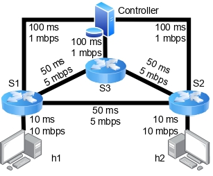
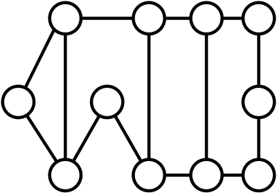

# Efficient-Rule-Caching
## About
This repository hosts the open-source implementation of our research paper "Efficient Collaborative Rule Caching Through Pairing of P4 Switches in SDNs" accepted for publication by the IEEE Global Communications Conference 2024. 
## License

© 2024 Mohammad Saberi.

This project's source code is released under the [GNU Affero General Public License v3](https://www.gnu.org/licenses/agpl-3.0.html) (AGPLv3). This means:

- **Redistribution:** You are free to redistribute the program or any modified version of it. However, you must also provide the full source code and a copy of the license to the recipient.
- **Modification:** Any modified version or derivative work must be licensed under the same terms as the original license.
- **Remote Access:** If users interact with your modified version remotely over a computer network, you must make the source code of the modified program available to them under the same licensing terms.

**In short (TL;DR):** If you modify and distribute this project, you must also open-source your derivative work's source code under the AGPLv3.

## Description

Software-defined networks (SDNs) provide customizable traffic control by storing numerous rules in on-chip memories with minimal access latency. However, the current on-chip memory capacity falls short of meeting the growing demands of SDN control applications. While rule eviction and aggregation strategies address this challenge at the switch level, programmable data planes enable a more flexible approach through cooperative rule caching.
In this project, we implement a method for optimizing the management of switch capacity in SDNs through efficient collaborative rule caching, specifically exploring the pairing of P4 switches to enhance performance. We present an efficient solution for the cooperative rule caching problem by designing a resource-efficient switch capable of caching rules for its neighbors, alongside a lightweight protocol for retrieving cached rules. Our approach includes:

### 1. Emulation
In this section, we utilize [P4-Utils](https://nsg-ethz.github.io/p4-utils/introduction.html) to facilitate our emulation setup. P4-Utils provides a suite of tools designed to streamline the development and testing of P4-based network applications. By leveraging P4-Utils, we can efficiently simulate the behavior of P4 switches and validate our cooperative rule caching approach within a controlled environment.

Additionally, we create the network topology using [Mininet](http://mininet.org/), which allows us to design and deploy a virtual network to test our solution. Mininet provides a flexible platform for emulating network topologies and observing how our method performs under different configurations.

In this setup, we have a topology consisting of three switches, two hosts, and one controller. This topology is illustrated in Figure 1.

The emulation setup enables us to verify the effectiveness of our approach and make preliminary adjustments before scaling up to more extensive simulations and real-world applications.

### 2. Simulation
In this section, we describe the implementation and evaluation of our algorithms using Python 3.10. We utilized SCIPY as the solver for Integer Linear Programming (ILP) and Linear Programming (LP) tasks.

We employed the [Abilene network topology](https://www.cs.utexas.edu/~yaron/abilene/) for our simulations, as depicted in Figure 3.

Our primary focus here is on the implementation details. For a comprehensive understanding of the theoretical foundations and in-depth analysis, please refer to our published paper, which provides detailed explanations and insights into our work.

